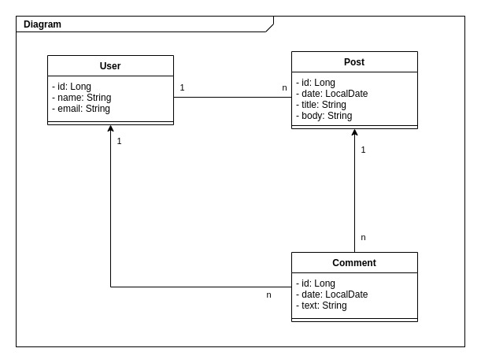

Todo List:

- User CRUD
    - User's can have same names
    - Email has to be unique
    - Name can't be empty or null
    - Name can't have special characters but can contain white spaces
    - Name max size is 15 characters 
- Post CRUD
    - Only post's owner can exclude its posts
    - Title can't be empty or null
    - Title can contain special characters and white spaces
    - Title max size is 30 characters
    - Body can contain any text
    - Body min size is 1 and max size is 150
- Comment CRUD
    - If post's owner, can exclude any comments of the post
    - If not post's owner, exclude only your comment from the post
    - Comment can contain any text
    - Comment min size is 1 and max size is 150
    

